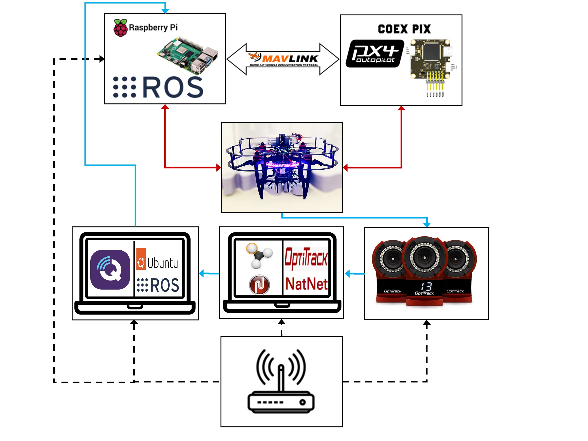
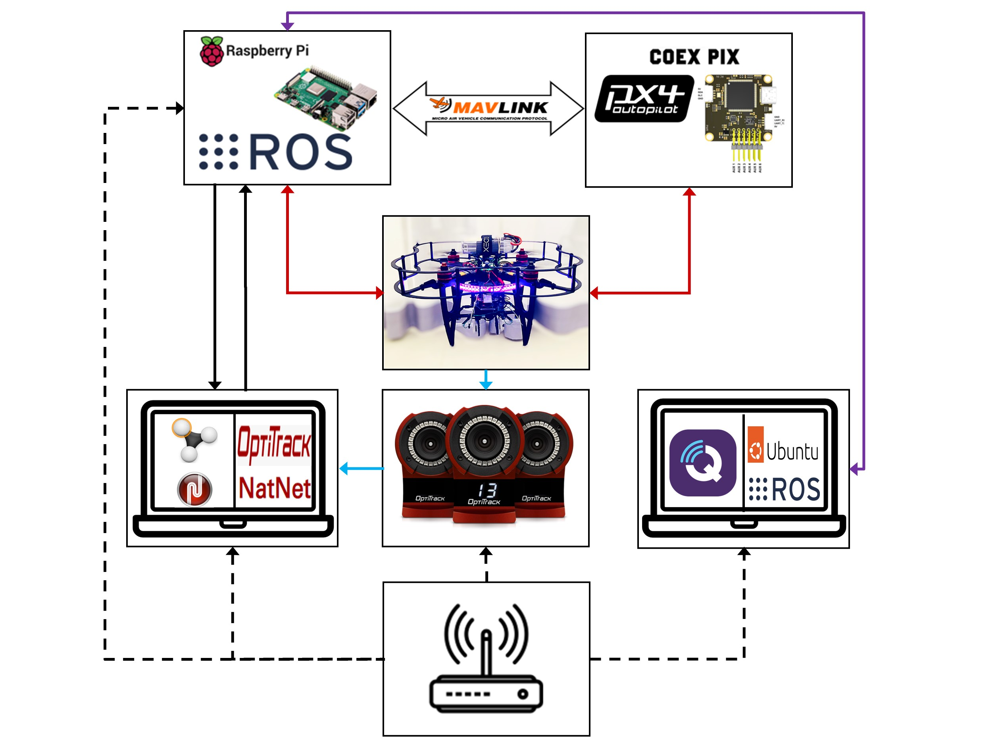

# Feeding Pose Data into ROS on Raspberry Pi

The first step is to install the <mark style="color:red;">**vrpn\_**</mark>_<mark style="color:red;">**client\_**</mark>_<mark style="color:red;">**ros**</mark> package to access the pose data streamed from the motion capture computer (Motive software) and then sending it to the raspberry pi.&#x20;

### Working Method

This can be done by setting up an Ubuntu Linux environment. Ubuntu has ROS packages prebuilt therefore building the vrpn ROS driver is straight forward. The pose data can be transferred to the raspberry Pi through a [ROS network](http://wiki.ros.org/ROS/NetworkSetup). I used the Clover virtual machine environment on my laptop, however it can be setup on the motion capture system computer running Motive as well. The installation and setup process for this environment is listed:

* [Virtual Machine](https://clover.coex.tech/en/simulation\_vm.html#simulation-vm-setup)
* [Native Installation](https://clover.coex.tech/en/simulation\_native.html#native-setup)

The configuration and setup process is further discussed.


ROS network communication works using a Transmission Control Protocol (TCP), some details on this can be found on the [ROS website](http://wiki.ros.org/ROS/Technical%20Overview).&#x20;


Some downfalls with TCP:

> There are many ways to ship data around a network, and each has advantages and disadvantages, depending largely on the application. TCP is widely used because it provides a simple, reliable communication stream. TCP packets always arrive in order, and lost packets are resent until they arrive. While great for wired Ethernet networks, these features become bugs when the underlying network is a lossy WiFi or cell modem connection. In this situation, UDP is more appropriate. When multiple subscribers are grouped on a single subnet, it may be most efficient for the publisher to communicate with all of them simultaneously via UDP broadcast.


The TCP/ROS network method provided in this document should suffice, although I recently developed a UDP communication protocol that receives data from Motive and remaps it the the PX4. I may look to develop another tutorial on this in the future however UDP data transmission is very simple and the implementation is more efficient then the ROS network method provided in this document.


A block diagram of the entire transmission setup can be seen:

<figure><figcaption>
ROS network experimental setup topology. Legend: Black dotted line is the provided local network; Blue solid line is the Clover pose transmission where the final transmission from laptop to Pi is over a ROS network; Red line is hardware connections; MAVlink arrow is communication via a MAVlink protocol.
</figcaption></figure>

 

<figure><figcaption>
UDP transmission experimental setup topology. Legend: Black dotted line is the provided local network; Black solid line is the UDP client-server drone pose transmission; Light blue line is the pose data transmission; Red line is hardware connections; Purple line is communication via secure shell protocol and ROS network communication; MAVlink arrow is communication via a MAVlink protocol.   
</figcaption></figure>

### Additional Considerations

During the debugging stages of this project I was considering a wide range of software topologies. The first one involved installing the VRPN ROS driver on the raspberry Pi where intuitively would be the most efficient way to transfer the pose data from motive to the raspberry Pi. The thought process and issues are discussed:

* This could be done by giving the raspberry Pi internet access using an ethernet cable and WIFI router or reconfiguring the raspberry pi to use an external network with internet rather then its own. Before doing this, extra ROS packages and dependencies would need to be built for this ROS driver because the raspberry Pi Operating System (OS) does not have these packages prebuilt and only core packages are provided through the Clover Pi image listed [here](http://packages.coex.tech/packages/). The package dependencies are listed:
  * [catkin](http://wiki.ros.org/catkin?distro=noetic)
  * [geometry\_msgs](http://wiki.ros.org/geometry\_msgs?distro=noetic)
  * [roscpp](http://wiki.ros.org/roscpp?distro=noetic)
  * [tf2\_ros](http://wiki.ros.org/tf2\_ros?distro=noetic)
  * [vrpn](http://127.0.0.1:5000/s/q0NsGVgxmRD8c4yuqaAR/fundamentals)

where the only one not contained in the Clover Pi image is the vrpn. If the vrpn ROS driver was successfully setup, the next steps would be configuring the motion capture system to stream data while connected to the raspberry Pi.&#x20;


I would advise using an external network connected to the internet, which automatically syncs clocks. If you used the raspberry Pi network you would need to use an application like chrony to synchronize clocks between devices (raspberry Pi and motion capture system computer). I have done this but it is not ideal. Also, the range on the raspberry Pi network is limited so using an internet router would most likely be the better choice.


Next remapping the topic either through a [launch file](http://wiki.ros.org/roslaunch/XML/remap) or [topic\_tools](http://wiki.ros.org/topic\_tools) which is another ROS package that would require dependencies set up. Due to the architecture of the Rasperian OS, these packages may not be possible to build. If one could set the raspberry Pi up with an Ubuntu server then the architecture issues may be avoided.
