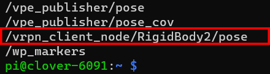
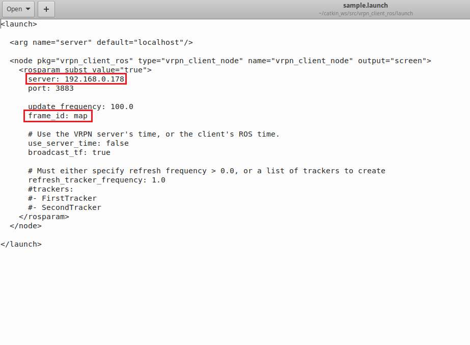

# VRPN ROS Package

With the Pi connected to the internet on the same router as the motion capture system, the vrpn package can now be installed and data can be streamed from the motion capture system to the Clover. The vrpn ROS package can be found on the [ROS website](http://wiki.ros.org/vrpn\_client\_ros). If the Ubuntu machine has ROS kinetic, then the vrpn driver can be installed with the following:

```bash
sudo apt-get install ros-kinetic-vrpn-client-ros -y
```

with newer versions of ROS, it must be installed and built from source. The following two links: [one](https://answers.ros.org/question/285887/ros\_vrpn\_client-installation-help/) and [two](https://answers.ros.org/question/297054/vrpn\_client\_ros-unable-to-locate-package/), provide good insight on how to do this. The steps needed to build from source are provided for ROS noetic:

```bash
cd /path/to/your/catkin_ws/src
git clone -b kinetic-devel https://github.com/ros-drivers/vrpn_client_ros.git
cd /path/to/your/catkin_ws
rosdep update
rosdep install --from-paths src/ --ignore-src --rosdistro noetic
catkin_make
```


The package build commands were for ROS noetic. If it was for another version like ROS melodic then the noetic would simply be replaced by melodic in the fifth line as such:


```bash
rosdep install --from-paths src/ --ignore-src --rosdistro melodic
```

Once the vprn ROS driver is installed in Ubuntu, you can obtain the rigid body pose on an individual topic by running:

```bash
roslaunch vrpn_client_ros sample.launch server:=<mocap machine ip>
```

If the rigid body was named <mark style="color:blue;">RigidBody2</mark> a topic will be produced like <mark style="color:blue;">/vrpn\_client\_node/RigidBody2/pose</mark> as seen:&#x20;

<figure><figcaption></figcaption></figure>

What I found easier is go into the <mark style="color:orange;">sample.launch</mark> file and manually set the server IP address as the motion capture system IP so the command can be run without the server definition. Also, in order to compare the pose estimation of the external vision source with the onboard pose estimation (EKF output), the frame ID should be set to "map" where it is originally set to "world". This is because the onboard position estimation topic <mark style="color:purple;">/mavros/local\_position/pose</mark> is in the map frame and in order for RViz to render the external pose estimation for comparison the topic must be in the "map" reference frame. These setting changes can be seen in the following figure:

<figure><figcaption><p>VPRN sample.launch file</p></figcaption></figure>
