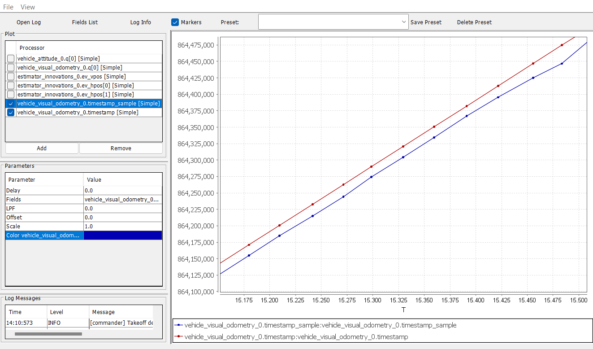
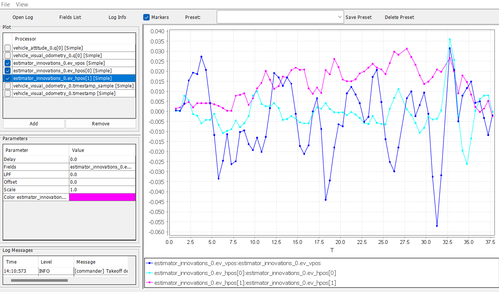

# EKF2 and LPE Tuning and Consistancy

### EKF2 Tuning

As discussed previously, certain delay parameters must be tuned in order to have the EKF2 working properly. This parameter is defined as [EKF2\_EV\_DELAY](https://docs.px4.io/main/en/advanced\_config/parameter\_reference.html#EKF2\_EV\_DELAY) which is the _Vision Position Estimator delay relative to IMU measurements_. The PX4 website describes its purpose:

> Or in other words, it is the difference between the vision system timestamp and the "actual" capture time that would have been recorded by the IMU clock (the "base clock" for EKF2).
>
> Technically this can be set to 0 if there is correct timestamping (not just arrival time) and timesync (e.g NTP) between MoCap and (for example) ROS computers. In reality, this needs some empirical tuning since delays in the entire MoCap->PX4 chain are very setup-specific. It is rare that a system is setup with an entirely synchronized chain!

It's important to make sure that EKF2 estimator provides accurate enough estimates of the states for your flight controller to perform well. One way to analyze is through the log files. These methods are presented in this [link](https://docs.px4.io/main/en/ros/external\_position\_estimation.html#tuning-EKF2\_EV\_DELAY).

The default log file format in PX4 is _Ulog._ Usually, the default setting, is the logs start after arming the vehicle and stopped after disarm i.e. [SDLOG\_MODE](https://docs.px4.io/main/en/advanced\_config/parameter\_reference.html#SDLOG\_MODE) parameter is set to 0. To enable logging of EV rates set bit 7 (Computer Vision and Avoidance) of [SDLOG\_PROFILE](https://docs.px4.io/main/en/advanced\_config/parameter\_reference.html#SDLOG\_PROFILE).

1. Setup the [wifi connection](https://clover.coex.tech/en/gcs\_bridge.html) between the Clover and OQroundControl (QGC) using TCP bridge so the flight logs can be downloaded for data analysis.
2. Use QGC to [download a Ulog file](https://docs.px4.io/v1.12/en/getting\_started/flight\_reporting.html#downloading-logs-from-the-flight-controller) you wish to analyze.
3. Download the [FlightPlot](https://github.com/PX4/FlightPlot/blob/master/README.md) to open your logs and analyze the topics of interest.
4. Plot the fields <mark style="color:yellow;">vehicle\_attitude\_0.q\[0]</mark>, and <mark style="color:yellow;">vehicle\_vision\_attitude\_0.q\[0]</mark>. This can be used to compare the external data vs. onboard estimate. Refer to the [PX4 website](https://docs.px4.io/main/en/ros/external\_position\_estimation.html#tuning-ekf2-ev-delay) to determine an approximate delay parameter from these plots.&#x20;

While step 4. above gives a rough estimate of the delay, another method is plotting <mark style="color:yellow;">vehicle\_visual\_odometry\_0.timestamp</mark> and <mark style="color:yellow;">vehicle\_visual\_odometry\_0.timestamp\_sample</mark> topics as shown:

<figure><figcaption></figcaption></figure>

The topic (timestamp) is the time PX4 received the message and (timestamp\_sample) is the time you put on the sent message. The figure above gives about a 25 ms (the y-axis time is in microseconds) and therefore it is a reasonable delay that can be dealt with.

With the delay parameter set well enough for good performance, it can be finely tuned by checking the EKF2 innovations as described:

1. When a MoCap measurement arrives, the EKF calculates the difference between the predicted position and the position from the MoCap. This difference is called an ‘Innovation’.
2. Further tune the delay parameter by plotting the fields <mark style="color:yellow;">estimator\_innovations\_0.ev\_pos\_innov\[3]</mark>, <mark style="color:yellow;">ekf2\_innovations\_0.vel\_pos\_innov\[4]</mark>, and <mark style="color:yellow;">ekf2\_innovations\_0.vel\_pos\_innov\[5]</mark>. Those are the innovations on the x/y/z position estimates reported by the EKF2. They should very small values, (ideally zero!), see the picture below for reasonable values. If those values are large, then EKF2 is not providing accurate estimation. This is most likely because of the inconsistency of timestamps of the fused measurements. For that, you will need to start adjusting the <mark style="color:red;">EKF2\_EV\_DELAY</mark> parameter that affects the position estimates. It should be decreased if mocap data is fed at a high rate (look into motive software and see what the frequency is set to, or use topic\_tools function to throttle the frequency of a topic).

<figure><figcaption></figcaption></figure>

### LPE Tuning

This tutorial is based around using the EKF2 although if the LPE was used, tuning its performance can be done from the following [section](https://docs.px4.io/main/en/ros/external\_position\_estimation.html#tuning-noise-parameters) on the PX4 website.

