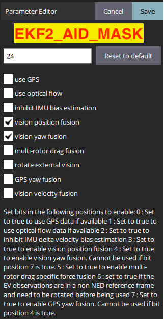
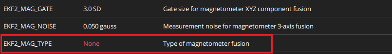
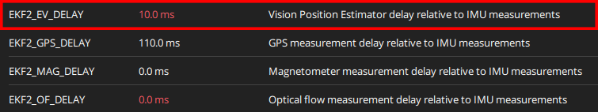
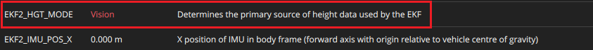

# EKF2 Configuration

The following will be a quick overview on the configurations needed using the MoCap, more detailed information on tuning and configuration can be found in the [EKF2 tuning guide](https://docs.px4.io/main/en/advanced\_config/tuning\_the\_ecl\_ekf.html).

* First choose **ekf2** as the estimator from the Systems tab by setting <mark style="color:orange;">SYS\_MC\_EST\_GROUP = ekf2</mark>&#x20;

<figure><figcaption></figcaption></figure>

* In the EKF2 parameter tab, set <mark style="color:red;">EKF2\_AID\_MASK</mark> to **not** use GPS or optical flow, and use vision position fusion and vision yaw fusion. This is done by setting the parameter to 26 bit. This will also select use optical flow which can be deselected (24 bit) or not as it won't be used because it is not set up. Don't use vision velocity fusion as the MoCap isn't providing velocity, only position and orientation. The onboard EKF estimates velocity.

<figure><figcaption></figcaption></figure>

* It is a good idea to disable the use of the magnetometer when using the EKF for indoor flight as it may interfere with the external vision pose provided by the MoCap. This can be done by setting the <mark style="color:red;">EKF2\_MAG\_TYPE</mark> parameter to 5 bit which is none.

<figure><figcaption></figcaption></figure>

* There are some delay parameters that need to be set properly because they directly affect EKF estimation. For more information see the detailed document presented [before](https://docs.px4.io/main/en/advanced\_config/tuning\_the\_ecl\_ekf.html). The tuning process can be found [here](https://docs.px4.io/main/en/ros/external\_position\_estimation.html#ekf2-tuning-configuration) which is to handle the setup specific time delays. The delay parameter is set below and the methods used to approximate this can be found in a following [section](ekf2-and-lpe-tuning-and-consistancy.md).

<figure><figcaption></figcaption></figure>

* Choose the height mode to be vision <mark style="color:orange;">EKF2\_HGT\_MODE = Vision</mark>

<figure><figcaption></figcaption></figure>

* (OPTIONAL, for better accuracy). Set the position of the center of the markers (that define the rigid body in the mocap system) with respect to the center of the flight controller. +x points forward, +y right, +z down. This conversion will provide control of the Clover relative to the center rather then the focal point of the rigid body.
