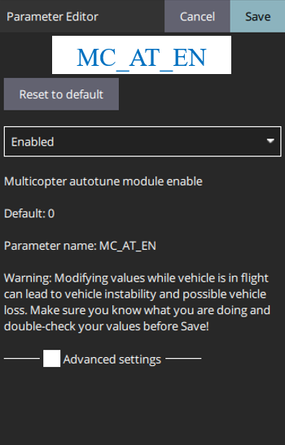
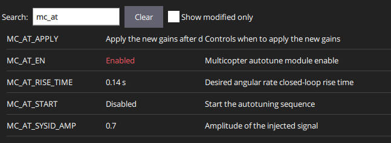

# Auto-Tuning

<figure><figcaption>
PID controller tuning
</figcaption></figure>

This section aims to give Clover users a better understanding on PX4 auto-tuning and how to use it with the Motion Capture System setup. The technicalities behind auto-tuning from a control perspective are well explained in the following video:



The importance of tuning the inner control module is highlighted on the [PX4 website](https://docs.px4.io/main/en/config/autotune.html#auto-tuning):

> Auto-tuning automates the process of tuning the PX4 rate and attitude controllers, which are the most important controllers for stable and responsive flight (other tuning is more "optional").

## Pre-tuning Conditions

In order to autotune the Clover, it must be able to adequately stabilize itself before running autotune. This is because the process takes place while flying. Luckily for Clover, the standard airframe provided for [COEX Clover 4.2](https://docs.px4.io/main/en/airframes/airframe\_reference.html#quadrotor-x) sets the control gains well enough for this. Fine tuning the attitude control module is important for stable flight but also quite challenging, therefore auto tuning is a good start.&#x20;


If the user desires, a [basic](https://docs.px4.io/main/en/config\_mc/pid\_tuning\_guide\_multicopter\_basic.html#multicopter-pid-tuning-guide-manual-basic) and [advanced](https://docs.px4.io/main/en/config\_mc/pid\_tuning\_guide\_multicopter.html) overview on manually tuning the PID gains is provided.


## Auto-tuning Environmental Setup

The auto-tuning must be performed in a controlled and safe environment. This means no wind etc as the auto-tuning can't compensate for unmodeled dynamics or hardware defects. Therefore, a motion capture volume provides an ideal solution for this. The larger the volume the better although we performed auto-tuning in a smaller volume successfully, one just has to be careful with the disturbance/step inputs. Two setups are recommended which are listed:

1. Using the Motion Capture System setup, take off in [Position mode](https://docs.px4.io/main/en/flight\_modes/position\_mc.html#position-mode-multicopter) to about 1m above the ground (the LEDs will be blue when the Clover is receiving pose feedback and is ready for use). This could also be done with Clovers ArUco marker localization system, although if the Motion Capture System is available, then using a more precise and reliable pose feedback system is preferred.
2. Using the range finder for altitude control, take off in [Altitude mode](https://docs.px4.io/main/en/flight\_modes/altitude\_mc.html#altitude-mode-multicopter) 1m above the ground (light colors??). A larger airspace is required as X and Y are not automatically maintained.


To this point we have only highlighted flight setup with the Motion Capture System, although Altitude mode with the range finder is quite simple. Follow the steps [here](https://clover.coex.tech/en/laser.html#working-with-a-laser-rangefinder) to setup the range finder. It highlights the settings needed in the Clover launch files as well as the PX4 parameter settings. Once setup properly, flying in altitude mode is the same as Position mode except the Clover will only hold its altitude but wont hold its X and Y position. Therefore a larger airspace would be needed for auto-tuning in this mode.


## Auto-tuning step by step

With the selected environment setup for tuning the Clover, the following steps can be followed to begin through the first iteration of the tuning process:

1. The first step is enabling the auto-tune module with the <mark style="color:purple;">MC\_AT\_EN</mark> parameter. This can be seen:

<figure><figcaption></figcaption></figure>

After the module is enabled, reboot the Clover. Once this is done the following parameters become available with the module:

<figure><figcaption></figcaption></figure>

2. Two design parameters need to be set before beginning auto-tune. The first is the <mark style="color:purple;">MC\_AT\_RISE\_TIME</mark> corresponding to the desired angular rate closed-loop rise time. Details on this topic can be found in the [Auto-Tune Parameter](auto-tune-parameter.md#tunable-px4-meta-parameters-for-auto-tune-module) section. The second parameter is the <mark style="color:purple;">MC\_AT\_SYSID\_AMP</mark> amplitude of the injected signal. The <mark style="color:purple;">MC\_AT\_APPLY</mark> can be left as default where it adjusts the gains when the Clover lands and disarms. The values set for these parameters in the video example at the end of this section can be seen in the following table:

<table><thead><tr><th>Parameter</th><th>Value</th><th data-hidden></th></tr></thead><tbody><tr><td>MC_AT_RISE_TIME</td><td>0.14s (default)</td><td></td></tr><tr><td>MC_AT_SYSID_AMP</td><td>2.7</td><td></td></tr></tbody></table>

3. The next step is putting the Clover in position mode and taking off to hover.  This process is described at the end of the [Flight Tests](../flight-tests/) section.&#x20;
4. Once you have a stable hovering point within the motion capture volume, start the auto-tuning process by enabling the <mark style="color:purple;">MC\_AT\_START</mark> parameter.

The demo auto-tuning procedure is found in the following video:


