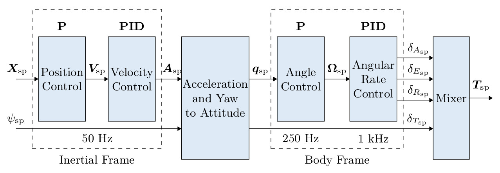

# Auto-Tune Control Theory

Before moving on to the trivial steps in using the auto-tune module, one may be interested in the control theory behind how it works. If this is not the case, you can simply skip this section.

A simplified block diagram of the entire PX4 control system can be seen in the following figure:

<figure><figcaption></figcaption></figure>

This control architecture is standard in UAV flight control as it uses a cascaded Proportional Integral Derivative (PID) architecture to act on position and attitude of the quadcopter. A table with the represented parameters can be seen:

<figure><figcaption></figcaption></figure>

Simplified mathematical models for these states with the position control and attitude control dynamics can be seen:

$$
\begin{bmatrix}
    \ddot{x}\\ \ddot{y} \\ \ddot{z}
    \end{bmatrix}
    =
    \begin{bmatrix}
    0 \\ 0 \\ g
    \end{bmatrix}
    +
    \begin{bmatrix}
   (C_{\psi}S_{\theta}C_{\phi} + S_{\psi}S_{\phi}) \\ (S_{\psi}S_{\theta}C_{\phi}-C_{\psi}S_{\phi}) \\ -(C_{\theta}C_{\phi})
    \end{bmatrix}
    \dfrac{U_{z}}{m} + 
    \begin{bmatrix}
    {\xi}_{x} \\ {\xi}_{y} \\ {\xi}_{z}
    \end{bmatrix}
$$

$$
\begin{bmatrix}
    {I}_{xx}\dot{\Omega}_{{\cal B}_{x}}\\ {I}_{yy}\dot {\Omega}_{{\cal B}_{y}}\\{I}_{zz} \dot {\Omega}_{{\cal B}_{z}}
    \end{bmatrix}
    =
    \begin{bmatrix}
   (I_{yy}-I_{zz}){\Omega}_{{\cal B}_{y}}{\Omega}_{{\cal B}_{z}} \\ (I_{zz}-I_{xx}){\Omega}_{{\cal B}_{x}}{\Omega}_{{\cal B}_{z}} \\ (I_{xx}-I_{yy}){\Omega}_{{\cal B}_{x}}{\Omega}_{{\cal B}_{y}}
    \end{bmatrix}
    +
    \begin{bmatrix}
    U_{\phi} \\ U_{\theta} \\ U_{\psi}
    \end{bmatrix}
    +
    \begin{bmatrix}
    M_{\phi} \\ M_{\theta} \\ M_{\psi}
    \end{bmatrix}
$$

The above equations illustrate the states that the control system look to control. A quadcopter is inherently very unstable which is why it requires such sophisticated controllers for flight. For the interest of the reader, a brief overview of all the important control parameters within PX4 are explained in the following video:



## Tunable PX4 Meta-Parameters for Auto-Tune Module

The main parameter that needed adjustment when setting up the auto-tune module is the <mark style="color:purple;">MC\_AT\_RISE\_TIME</mark> parameter. This can simply be described as:

> In PID control, the rise time refers to the time it takes for the system to reach its desired setpoint from its initial state. Specifically, it is the time required for the system output to rise from a specified percentage (often 10% or 90%) of the steady-state value to the setpoint value for the first time after a step change in the input. A shorter rise time indicates a faster response and a more agile system. However, too short of a rise time can result in overshooting and oscillations, which can lead to instability and poor control performance. Balancing the rise time with other control objectives, such as overshoot and settling time, is an important aspect of designing a PID control system.

Further understanding can be interpreted from this graph:

<figure><figcaption></figcaption></figure>

This is the systems closed loop unit step response. The system of interest is the angular rate module along with the attitude. As said previously, a shorter defined rise time indicates a faster response, this may be good when using small racer drones as fast adjustments are benficial and possible. However a quick risetime may not be feasible for certain drones where it will attempt but overshoot and oscillate with poor control. This may be the case with larger drones.&#x20;

Upon autotuning the Clover, run an autonomous flight and analyze how well it maintains its level horizontal level and tracks setpoints. While tracking can be improved with the outer control module (position and velocity) its orientation/attitude control will have a larger impact on the Clovers overall flight performance.
