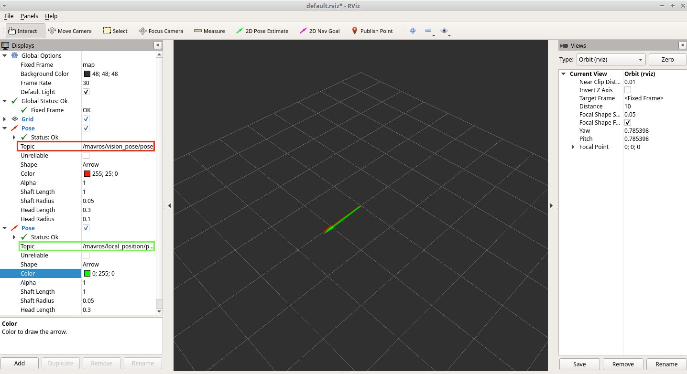
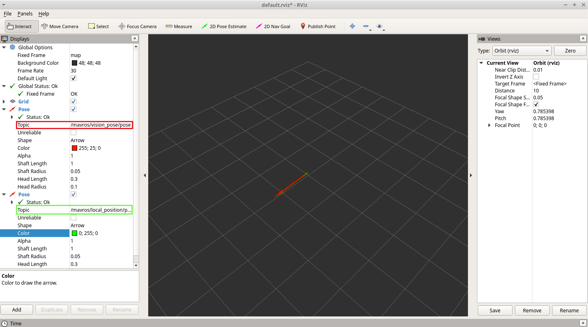

# Flight Tests

After setting up all the previous system requirements, flight tests should be ready. The following section illustrates pre-flight checks to ensure a successful setup.

### Compare external MoCap estimate against onboard pose estimate through RViz

Alignment between the body frame of the Clover and reference frame of external pose can be done with the following [steps](https://docs.px4.io/main/en/ros/external\_position\_estimation.html#first-flight). Although, if the setup was done properly where the rigid body was created when the x-axis of the Clover (forward direction) coincided with the x-axis of the MoCap (seen in the motive software) then this was taken care of and yaw offsets wont cause data fusion and flight control issues.

this alignment along with analysis of both the external pose estimates and onboard pose estimates can be done through RViz. The steps are illustrated:

* Before remapping the <mark style="color:purple;">/vrpn\_</mark>_<mark style="color:purple;">client\_node/clover1/pose</mark> <mark style="color:red;"></mark>_ topic _to <mark style="color:red;">/mavros/vision</mark>_<mark style="color:red;">\_</mark>_<mark style="color:red;">pose/pose</mark> with_ topic\_tools, plot _<mark style="color:purple;">/vrpn\_client\_node/clover1/pose</mark>_ and _<mark style="color:yellow;">/mavros/local\_position/pose</mark>_ in RViz and see how well they are aligned. If they are not aligned, rotate the drone in the MoCap volume space until they are aligned. If the vision yaw and estimated yaw vary too much in the beginning, the vision yaw may not fuse with the estimated one and an error will occur. This also ensures the x-axis of the Clover corresponds with the x-axis of the Mocap as desired. Good alignment can be seen in the following figure:

<figure><figcaption>
External pose estimation provided by MoCap aligned with the onboard pose estimation provided by Clover.
</figcaption></figure>

* Remap the _<mark style="color:purple;">/vrpn\_client\_node/clover1/pose</mark>_ topic to _<mark style="color:red;">/mavros/vision\_pose/pose</mark>_ then plot both _<mark style="color:red;">/mavros/vision\_pose/pose</mark>_ and _<mark style="color:yellow;">/mavros/local\_position/pose</mark>_ topics in RViz and see if the estimated pose is fused to the vision pose. Move the drone around and watch the estimated pose follow the vision pose with position and orientation. If this does not happen, then the fusion was not successful and avoid flying until they are. Well fused topics can be seen in figure:

<figure><figcaption>
External pose estimation provided by MoCap fused with the onboard pose estimation provided by Clover.
</figcaption></figure>


Ensure the Clover is connected to the ground station (QGC) when fusing data because if errors do occur they will be printed in the notifications. This will give a starting point to help debug the issue. Also, while the above steps give the user a confirmed understanding of the data fusion, they should not be necessary if the reference frame of the mocap along with the defining of the rigid body were done correctly.


If those steps are consistent, you can try your first flight:

1. Using the RC controller set the Clover to position mode; the LEDs should turn blue to indicate the drone is in position mode illustrating position feedback is available and position control is activated.
2. Put your left stick at the middle, this is the dead zone. With this stick value, the robot maintains its altitude; raising the stick will increase the reference altitude while lowering the value will decrease it. Same for right stick on x and y.
3. Arm the motors and increase the value of the left stick slowly and the Clover will take off, put it back to the middle right after. Check if it is able to keep its position.
4. If it works, you may want to set up an offboard experiment by sending position-setpoints using the simple Clover functions in the 'map' or 'body' reference frame. The next section will talk about this while providing a more complicated example of complex trajectory tracking.
