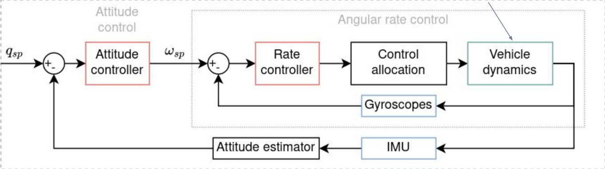
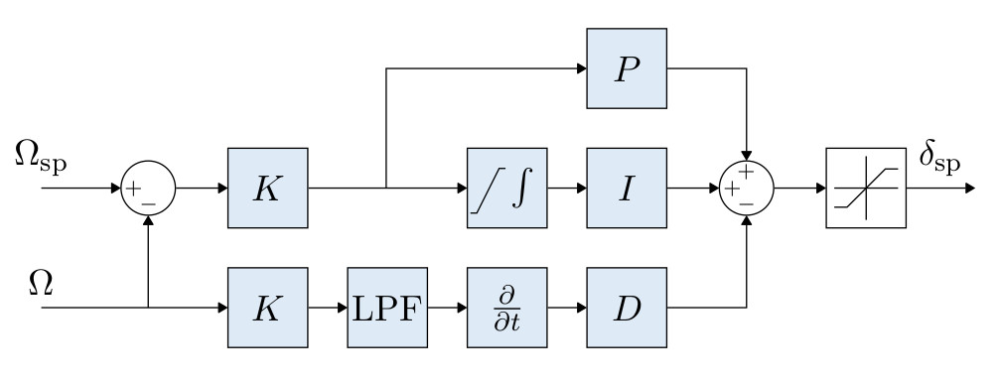

# Offboard Control Overview

An explanaton of offboard control is discussed on the [Clover website](https://clover.coex.tech/en/simple\_offboard.html#autonomous-flight):

> The `simple_offboard` module of the `clover` package is intended for simplified programming of the autonomous drone flight (`OFFBOARD` [flight mode](https://clover.coex.tech/en/modes.html)). It allows setting the desired flight tasks, and automatically transforms [coordinates between frames](https://clover.coex.tech/en/frames.html).
>
> `simple_offboard` is a high level system for interacting with the flight controller. For a more low level system, see [mavros](https://clover.coex.tech/en/mavros.html).
>
> Main services are [`get_telemetry`](https://clover.coex.tech/en/simple\_offboard.html#gettelemetry) (receive telemetry data), [`navigate`](https://clover.coex.tech/en/simple\_offboard.html#navigate) (fly to a given point along a straight line), [`navigate_global`](https://clover.coex.tech/en/simple\_offboard.html#navigateglobal) (fly to a point specified as latitude and longitude along a straight line), [`land`](https://clover.coex.tech/en/simple\_offboard.html#land) (switch to landing mode).

The following section gives brief descriptions on how the low level controllers handle the high level commands sent from these functions within `simple_offboard` and details how they use mavros to accomplish the setpoint publishing. Also, a modified `simple_offboard` module is discussed in section [Feedforward Simple Offboard](complex-trajectory-tracking/feedforward-simple-offboard.md) where feedforward control is implemented through the <mark style="color:green;">navigate</mark> function.

## Control Architecture

An overview of the PX4 control architecture will be presented to give the user a better understanding one how to publish setpoints, how they are handled and what kind of control is needed. A simplified overview of the control structure within PX4 can be seen:

<figure><figcaption>
PX4 control architecture overview [<a href="https://docs.px4.io/v1.12/en/flight_stack/controller_diagrams.html#multicopter-control-architecture">reference</a>]
</figcaption></figure>

The position control module is in the inertial reference frame and the attitude control module is in the body reference frame. The innermost controllers are the angular rate controllers and the outer most ones are the position controllers where PID stands for Proportional, Integral, and Derivative controllers. It is assumed the user has a basic understanding of PID controller. A table highlighting each parameter from the figure is presented:

| Control Signal | Description                           |
| -------------- | ------------------------------------- |
| X\_sp          | Inertial position setpoint            |
| psi\_sp        | Yaw setpoint                          |
| V\_sp          | Inertial linear velocity setpoint     |
| A\_sp          | Inertial linear acceleration setpoint |
| q\_sp          | Unit quaternion setpoint              |
| Omega\_sp      | Body angular rate setpoint            |
| detla\_{A\_sp} | Aileron setpoint                      |
| detla\_{E\_sp} | Elevator setpoint                     |
| detla\_{R\_sp} | Rudder setpoint                       |
| detla\_{T\_sp} | Total thrust setpoint                 |
| T\_sp          | Actuator input setpoint               |

For the interest of the reader, a brief overview of the control structure and important control parameters within PX4 are explained in the following video:



Using Offboard control mode allows the user to autonomously control the Clover without using the RC transmitter. This means we can send setpoints to the control signals as desired. A quadcopter is inherently unstable therefore each control level offers an additional layer of stability allowing for easier implementation for the user. We will discuss various publishing methods used for autonomous control.

The current simpleoffboard module provided by Clover has three main publishing functions. A description of this module can be found on the [COEX website](https://clover.coex.tech/en/simple\_offboard.html#autonomous-flight). The publishing method and how PX4 control architecture handles these messages will be described in the following sections. The five main functions of interest are listed:

1. [navigate](https://clover.coex.tech/en/simple\_offboard.html#navigate)
2. [set\_position](https://clover.coex.tech/en/simple\_offboard.html#setposition)
3. [set\_velocity](https://clover.coex.tech/en/simple\_offboard.html#setvelocity)
4. [set\_attitude](https://clover.coex.tech/en/simple\_offboard.html#setattitude)
5. [set\_rates](https://clover.coex.tech/en/simple\_offboard.html#setrates)

### Publishing to position control module

This is the method used throughput the rest of the documentation, and how Clover sets up the simpleoffboard module to control the Clover. It is similar to operating in [Position Mode](https://clover.coex.tech/en/modes.html#assisted-flight-modes) with the RC transmitter where velocity setpoints are used. High-level control commands are sent to the _PX4 such as_ position, velocity , or acceleration set-points. The _PX4_ will receive those set-points in the position control module to perform the necessary control actions before sending setpoints to the low-level controllers (e.g. attitude/engines control). Clover has developed a module that uses MAVROS to provide users a friendly and compact way in sending offboard commands to the Clover detailed [here](https://clover.coex.tech/en/simple\_offboard.html#autonomous-flight). Before explaining further, we can take a closer look at the position control module:

<figure><figcaption>
PX4 position control module [<a href="https://docs.px4.io/v1.12/en/flight_stack/controller_diagrams.html#combined-position-and-velocity-controller-diagram">https://docs.px4.io/v1.12/en/flight_stack/controller_diagrams.html#combined-position-and-velocity-controller-diagram</a>]
</figcaption></figure>

From the figure, there are three locations to publish setpoints to. The first being position setpoints to <mark style="color:yellow;">r\_sp</mark>, the second being velocity setpoints which would be fed into the velocity feedforward path <mark style="color:yellow;">v\_ff</mark>, and the third being acceleration setpoints fed to the acceleration feedforward path <mark style="color:yellow;">a\_ff</mark>. The three Clover simpleoffboard functions capable of sending setpoints to these gateways are discussed:

#### Navigate

The <mark style="color:green;">navigate</mark> function publishes position setpoints to <mark style="color:yellow;">r\_sp</mark>, it does by publishing on the <mark style="color:red;">mavros/setpoint\_position/local</mark> topic of type [geometry\_msgs/PoseStamped](http://docs.ros.org/en/api/geometry\_msgs/html/msg/PoseStamped.html). It does it in a special way where it will take the speed from the user (0.5 m/s by default); all this does is set the slope of the position setpoints to allow the Clover to track the position at a relative speed rather then just sending a step input as done by the <mark style="color:green;">set\_position</mark> function.&#x20;

This assumes the user is not setting the yaw parameter (`yaw=0` by default) or publishing a new value. If the user sets `yaw = float('NaN')` then `yaw_rate` is used (0 by default) which will publish the position and `yaw_rate` on the <mark style="color:red;">mavros/setpoint\_raw/local</mark> topic of type [mavros\_msgs/PositionTarget](http://docs.ros.org/en/api/mavros\_msgs/html/msg/PositionTarget.html).&#x20;

#### set\_position

The <mark style="color:green;">set\_position</mark> function publishes setpoints to <mark style="color:yellow;">r\_sp</mark> by publishing on the <mark style="color:red;">mavros/setpoint\_position/local</mark> topic of type [geometry\_msgs/PoseStamped](http://docs.ros.org/en/api/geometry\_msgs/html/msg/PoseStamped.html). Likewise, the handling of yaw and yaw\_rate has the same influence here as it did with the <mark style="color:green;">navigate</mark> function. You can use this function in a while loop within a python script to publish position along a complex trajectory, however it is very limited as it only allows you to publish setpoints to <mark style="color:yellow;">r\_sp</mark> whether a step input or a more complicated trajectory within a while loop using various equations. This is an issue because without feedforward control (using velocity, acceleration, etc..) PID control can only allow for relative tracking with the Clover and will lag behind the setpoints.

#### set\_velocity

The <mark style="color:green;">set\_velocity</mark> function publishes setpoints to <mark style="color:yellow;">v\_ff</mark> by publishing on the <mark style="color:red;">mavros/setpoint\_raw/local</mark> topic of type [mavros\_msgs/PositionTarget](http://docs.ros.org/en/api/mavros\_msgs/html/msg/PositionTarget.html). Likewise, the handling of yaw and yaw\_rate is similar to the <mark style="color:green;">set\_position</mark> and <mark style="color:green;">navigate</mark> functions where yaw can be defined (`yaw=0` by default) or set as `yaw = float('NaN')` then `yaw_rate` is used (0 by default). The <mark style="color:green;">set\_velocity</mark> function is set to ignore position and acceleration setpoints therefore only velocity can be published in its current state.

The last two functions publish to the inner or low-level control module. A diagram illustrating these controllers can be found:

<figure><figcaption>
PX4 attitude complete cascaded attitude control module.
</figcaption></figure>

The above figure is what is tuned automatically when you follow the steps in the [Auto-Tuning](../auto-tuning/) section.

#### set\_attitude

A closer look at the Attitude controller can be seen:

<figure><figcaption>
PX4 attitude nonlinear proportional controller [<a href="https://docs.px4.io/v1.12/en/flight_stack/controller_diagrams.html#multicopter-attitude-controller">https://docs.px4.io/v1.12/en/flight_stack/controller_diagrams.html#multicopter-attitude-controller</a>]
</figcaption></figure>

It is a proportional controller with some nonlinear components to it. The <mark style="color:green;">set\_attitude</mark> publishes to the quarternion setpoint <mark style="color:yellow;">q\_sp</mark> by first sending  roll, pitch, and yaw commands to the <mark style="color:red;">mavros/setpoint\_attitude/attitude</mark> topic of type [geometry\_msgs/PoseStamped](http://docs.ros.org/en/api/geometry\_msgs/html/msg/PoseStamped.html). This is eventually converted to a quarternion by PX4. The last setpoint provided is a thrust setpoint, this is normalized where 0 represents no throttle (propellers are stopped) and 1 represents full throttle. This is published on the <mark style="color:red;">mavros/setpoint\_attitude/thrust</mark> topic of type [mavros\_msgs/thrust](http://docs.ros.org/en/api/mavros\_msgs/html/msg/Thrust.html). Using this function is similar to operating in the [Stabilized Mode](https://clover.coex.tech/en/modes.html#manual-control).&#x20;

#### set\_rates

A closer look at the Rate controller can be seen:

<figure><figcaption>
<a href="https://docs.px4.io/v1.12/en/flight_stack/controller_diagrams.html#multicopter-angular-rate-controller">https://docs.px4.io/v1.12/en/flight_stack/controller_diagrams.html#multicopter-angular-rate-controller</a>
</figcaption></figure>

From the figure, the Rate controller is a K-PID controller offering two configuration choices for PID (Standard and Parallel) with more information found in [Rate Controller](https://docs.px4.io/v1.12/en/config\_mc/pid\_tuning\_guide\_multicopter.html#rate-controller). The <mark style="color:green;">set\_rates</mark> publishes to the rate setpoint <mark style="color:yellow;">Omega\_sp</mark> by first sending  roll\_rate, pitch\_rate, and yaw\_rate commands to the <mark style="color:red;">mavros/setpoint\_raw/attitude</mark> topic of type [mavros\_msgs/AttitudeTarget](http://docs.ros.org/en/api/mavros\_msgs/html/msg/AttitudeTarget.html). Similar to the <mark style="color:green;">set\_attitude</mark> function it publishes a normalized thrust setpoint where 0 represents no throttle (propellers are stopped) and 1 represents full throttle. This is through the same gateway at the rest of the rate commands where the function in `simple_offboard` ignores attitude setpoints. However if the user desired to send rate and attitude setpoints simultaneously, the <mark style="color:green;">set\_rates</mark> function could easily be modified to do so. Using this function is similar to operating in the [ACRO mode](https://clover.coex.tech/en/modes.html).


Setpoints must be given to PX4 at a rate of at least 2Hz or the Clover will go into failsafe mode, this sets the motors into safety mode where the Clover will mode likely glide into a fall. Preferably sending setpoints at 30 Hz or greater is desired for smooth trajectories. Clovers simple Offboard sends setpoints at 30 Hz.

