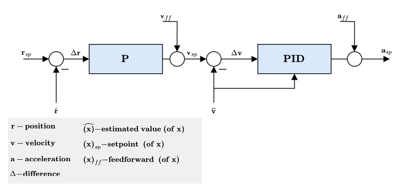

# Offboard Control Overview

## Control Architecture

An overview of the PX4 control architecture will be presented to give the user a better understanding one how to publish setpoints, how they are handled and what kind of control is needed. A simplified overview of the control structure within PX4 can be seen \[ref]:

<figure><figcaption>
PX4 control architecture overview [ref]
</figcaption></figure>

The position control module is in the inertial reference frame and the attitude control module is in the body reference frame. The innermost controllers are the angular rate controllers and the outer most ones are the position controllers where PID stands for Proportional, Integral, and Derivative controllers. It is assumed the user has a basic understanding of PID controller. A table highlighting each parameter from the figure is presented:

| Control Signal | Description                           |
| -------------- | ------------------------------------- |
| X              | Inertial position setpoint            |
|                | Yaw setpoint                          |
|                | Inertial linear velocity setpoint     |
|                | Inertial linear acceleration setpoint |
|                | Unit quaternion setpoint              |
|                | Body angular rate setpoint            |
|                | Aileron setpoint                      |
|                | Elevator setpoint                     |
|                | Rudder setpoint                       |
|                | Total thrust setpoint                 |
|                | Actuator input setpoint               |

For the interest of the reader, a brief overview of the control structure and important control parameters within PX4 are explained in the following video:



Using Offboard control mode allows the user to autonomously control the Clover without using the RC transmitter. This means we can send setpoints to the control signals as desired. A quadcopter is inherently very unstable therefore each control level offers an additional layer of stability allowing for an easier implementation for the user. We will discuss various publishing methods used for autonomous control.

The current simpleoffboard module provided by Clover has three main publishing functions. A description of this module can be found on the [COEX website](https://clover.coex.tech/en/simple\_offboard.html#autonomous-flight). The publishing method and how PX4 control architecture handles these messages will be described in the following sections. The five main functions of interest are listed:

1. navigate
2. set\_position
3. set\_velocity
4. set\_attitude
5. set\_rates

### Publishing to position control module

This is the method used throughput the rest of the documentation, and how Clover sets up the simpleoffboard module to control the Clover. It is similar to operating in [position mode](https://clover.coex.tech/en/modes.html#assisted-flight-modes) using the RC transmitter. High-level control commands are sent to the _PX4 such as_ position, velocity , or acceleration set-points. The _PX4_ will receive those set-points in the position control module to perform the necessary control actions before sending setpoints to the low-level controllers (e.g. attitude/engines control). Clover has developed a module that uses MAVROS to provide users a friendly and compact way in sending offboard commands to the Clover detailed [here](https://clover.coex.tech/en/simple\_offboard.html#autonomous-flight). Before explaining further, we can take a closer look at the position control module:

<figure><figcaption>
PX4 position control module
</figcaption></figure>

From the figure, there are three locations to publish setpoints to. The first being position setpoints to <mark style="color:yellow;">r\_sp</mark>, the second beng velocity setpoints which would be fed into the velocity feedforward path <mark style="color:yellow;">v\_ff</mark>, and the third being acceleration setpoints fed to the acceleration feedforward path <mark style="color:yellow;">a\_ff</mark>. The three Clover simpleoffboard functions capable of sending setpoints to these gateways are listed:

#### Navigate

The navigate function publishes position setpoints to <mark style="color:yellow;">r\_sp</mark>, <mark style="color:yellow;"></mark> it does by publishing on the <mark style="color:red;">mavros/setpoint\_position/local</mark> topic of type [geometry\_msgs/PoseStamped](http://docs.ros.org/en/api/geometry\_msgs/html/msg/PoseStamped.html). It does it in a special way where it will take the speed from the user; all this does is set the slope of the position publishing to allow the Clover to track the position at a relative speed rather then just sending a step input as done by the set\_position function. Also, this assumes the user is leaving the yaw alone or publishing a new value, if the user publishes yaw rate it will publish the position and yaw rate on the <mark style="color:red;">mavros/setpoint\_raw/local</mark> topic of time [mavros\_msgs/PositionTarget](http://docs.ros.org/en/api/mavros\_msgs/html/msg/PositionTarget.html)....

It also gives the user the ability to publish yaw or yaw\_rateThis is a simple but effective way to allow the user to autonomously command and control the Clover for general flight applications.

#### set\_position

The set\_position function publishes setpoints to <mark style="color:yellow;">r\_sp</mark> by publishing on the <mark style="color:red;">mavros/setpoint\_position/local</mark> topic of type [geometry\_msgs/PoseStamped](http://docs.ros.org/en/api/geometry\_msgs/html/msg/PoseStamped.html). While you can use this function in a while loop within a python script to publish position in a complex trajectory, it is still very limited as it only allows you to publish setpoints to <mark style="color:yellow;">r\_sp</mark> whether a step input or a more complicated trajectory within a while loop using various equations. This is an issue because without feedforward control (using velocity, acceleration, etc..) PID control can only allow for relative tracking with the Clover will lagging behind the setpoints.

* set\_position
* set\_velocity

OFFBOARD control means that we would like to send (usually) high-level control commands to _PX4_. For example, sending position, velocity , or acceleration set-points. The _PX4_ will receive those set-points in the position control module to perform the necessary control actions before sending setpoints to the low-level controllers (e.g. attitude/engines control). Clover has developed a module that uses MAVROS to provide users a friendly and compact way in sending offboard commands to the Clover detailed [here](https://clover.coex.tech/en/simple\_offboard.html#autonomous-flight).  The same functions can be used in the MoCap system as illustrated in <mark style="color:red;">simple\_hover.py</mark> except the reference frame is now set to 'map' which was defined in section (??) when setting up the data streaming. The origin of the reference frame will be where the user put the L-shape when setting the ground plane in the calibration steps.

If one desires, they can send attitude/thrust setpoints which would be like flying in stabalized mode?? (send attitude setpoints) or ACRO mode (sending attitude rate setpoints). However it is difficult to control with these unless the user is implementing a controller offboard that formulates attitude setpoints based on feedback (bypassing the position control module).


Setpoints must be given to PX4 at a rate of at least 2Hz or the Clover will go into failsafe mode, this sets the motors into safety mode where the Clover will mode likely glide into a fall. Preferably sending setpoints at 30 Hz or greater is desired for smooth trajectories. Clovers simple Offboard sends setpoints at 30 Hz.

