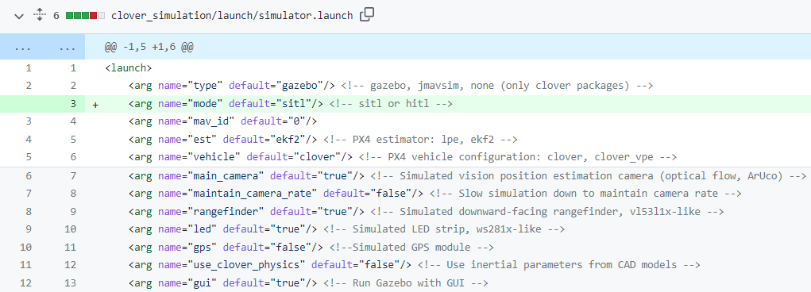
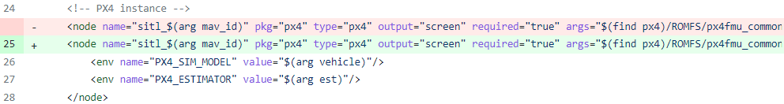
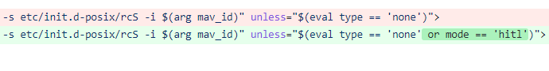
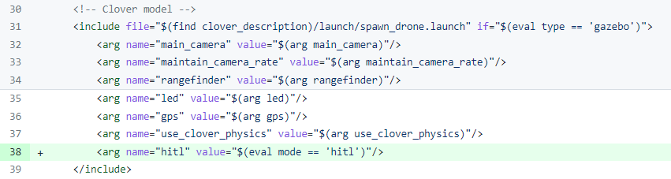
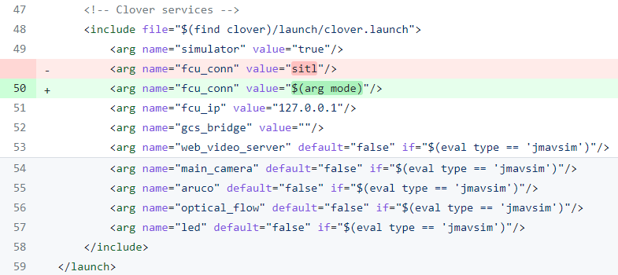
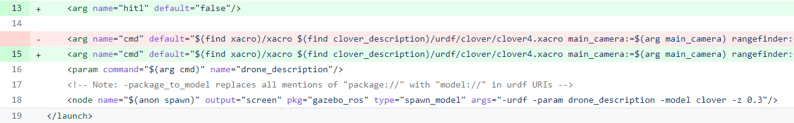
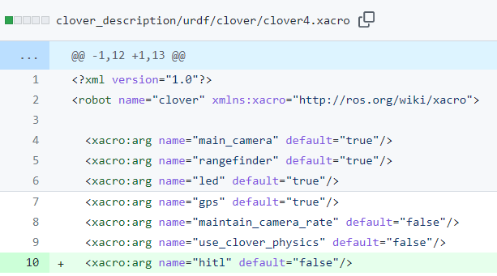

# Configure Clover Platform

This section will go through the [changes made](https://github.com/CopterExpress/clover/compare/hitl#diff-b1d477bea7f60c17b654d82ade75af5fb588771ff6cb87550a7347d6068421c5) to setup HITL simulations with Clover and it will also make reference to the [steps listed on the PX4 website](https://dev.px4.io/v1.9.0\_noredirect/en/simulation/hitl.html#simulator-setup) for general HITL simulation using the Iris quadcopter model and world.&#x20;

### simulation.launch

The first configuration step was defining a mode argument in the simulation.launch file since it is the file that is initially launched to begin SITL or HITL:

<figure><figcaption></figcaption></figure>

This mode argument is now used to configure the rest of the HITL setup. The next step was having the PX4 node or instance being turned off when this hitl mode was activated. In the sitl block --> link this... diagram this is the PX4 on sitl block. We do not want this on because we want the PX4 firmware onboard the flight controller running the simulation for hitl. This is accomplished with the following change:

<figure><figcaption>
Changing PX4 launch node
</figcaption></figure>

 

<figure><figcaption>
Disable with activated hitl
</figcaption></figure>

From the above figure, the PX4 node is disabled or not launched when the mode is set to 'hitl' as desired. The next changes can be seen:

<figure><figcaption></figcaption></figure>

The above figure shows that simulation.launch passes arguments to the spawn\_drone.launch file. It sets the arguments and the added one is the argument hitl with a set value of <mark style="color:blue;">**true**</mark> since mode=='hitl' is true in this case. The impact of this setting has a flow of influences and the first can be seen here... set link-->

The last change in this file can be seen:

<figure><figcaption></figcaption></figure>

This change was important because initially mavros and clover services are connected to PX4 firmware for SITL on port 14580 as seen in figure--> link figure. With the HITL setup, it should connect through port 14540 which is seen in the changes made to port designations in macros.launch section --> link and in the HITL figure --> link. In summary, the port set will be different depending on whether SITL is running or HITL is running.

### spawn\_drone.launch

The first changes made to this launch file can be seen:

<figure><figcaption></figcaption></figure>

<figure><figcaption></figcaption></figure>

The hitl argument has been added to this launch file, the default value is set to "false" but this has been overwritten to <mark style="color:blue;">**"true"**</mark> by the setting from the simulation.launch --> insert link file. This argument is then passed down to the following:

<figure><figcaption></figcaption></figure>

 

<figure><figcaption></figcaption></figure>

What is accomplished is the parameters are set for all the Xacro files which are Xml macros that introduce the use of macros in a urdf file. It allow the use of variables, math and macros and let us divide the robot model in different files. The drone is spawn from multiple files with the set arguments.

### clover4.xacro and clover4\_gazebo.xacro

Arguments are passed from the spawn\_drone.launch file to the clover4.xacro file:

<figure><figcaption></figcaption></figure>

The new argument added is of course the hitl one. The default value is "false" although it is set to true in this setup. This sets the argument for all the xacro files and influences the following one:

[http://wiki.ros.org/roslaunch/XML/arg](http://wiki.ros.org/roslaunch/XML/arg)     [http://wiki.ros.org/roslaunch/XML](http://wiki.ros.org/roslaunch/XML)   [https://abedgnu.github.io/Notes-ROS/chapters/ROS/10\_robot\_modeling/xarco.html](https://abedgnu.github.io/Notes-ROS/chapters/ROS/10\_robot\_modeling/xarco.html)  &#x20;
