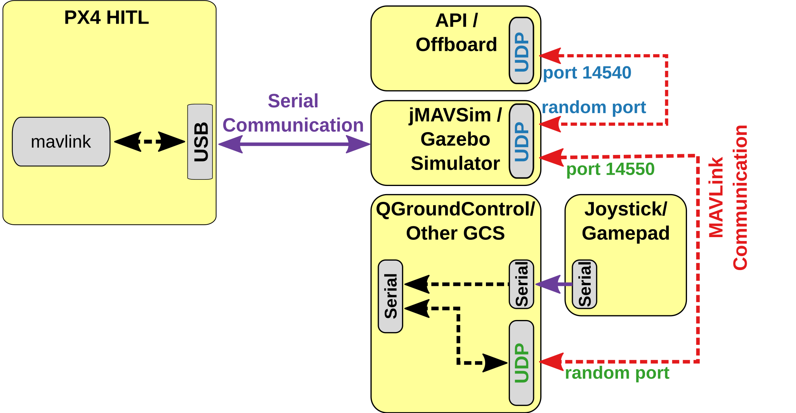

# HITL and SITL Background

### HITL vs. SITL

The implementation of Hardware In The Loop (HITL) simulations provides an extra step of testing for developers who are looking to migrate implementations applied with Software In The Loop (SITL) tests to experiment with the real Clover drone. A comparison between SITL and HITL is summarized on the [PX4 website](https://docs.px4.io/v1.12/en/simulation/hitl.html#hitl-vs-sitl) and quoted here:

> SITL runs on a development computer in a simulated environment, and uses firmware specifically generated for that environment. Other than simulation drivers to provide fake environmental data from the simulator the system behaves normally.
>
> By contrast, HITL runs normal PX4 firmware in "HITL mode", on normal hardware. The simulation data enters the system at a different point than for SITL. Core modules like commander and sensors have HITL modes at startup that bypass some of the normal functionality.
>
> In summary, HITL runs PX4 on the actual hardware using standard firmware, but SITL actually executes more of the standard system code.

To further illustrate these points, block diagrams are shown below:

<figure><figcaption>
PX4 SITL setup
</figcaption></figure>

 

<figure><figcaption>
PX4 HITL setup
</figcaption></figure>

The HITL block layout provides a good visualization to understand the changes implemented in the next setion --> provide line to it, to setup the HITL environment.

### Working with Clover Platform

For myself, I was looking to test a new controller which initially worked well in simulation but the results in experiment were not as expected. From here, HITL simulations seemed like a good next step. In general this setup is not overly complicated as PX4 provides a good setup to enable this testing. Although, the general application is done with the PX4 firmware using the Iris HITL quadcopter in standard world or Gazebo environments and we I or we would like to use it with the Clover drone and Clover world with aruco markers.&#x20;
