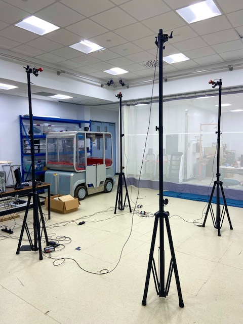
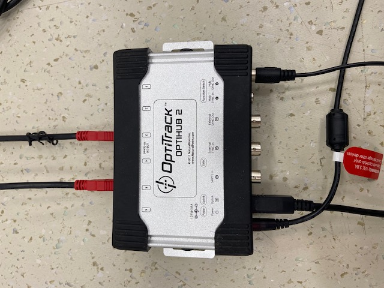

# Motion Capture Setup: OptiTrack

## By Example with 4 Camera Setup

This section provides brief descriptions on the steps to setup a 4 camera Optitrack motion capture system configuration. Adding more cameras would be accomplished similarly, the user will just need to reference the OptiTrack manual. The steps are as follows: &#x20;

* Orient the cameras on the stands in a square and make sure the attached cameras are plugged in (this is one way although many configurations are possible).
* Use two different hubs and plug two cameras into one hub (usb ports) and two cameras into the other hub.
* Connect the power ports of the hubs into a power bar with appropriate wires.
* Plug the usb type B into the port next to the power port (uplink port) and then connect to the usb port in the computer. Do this for each hub.
* Connect both hubs by connecting the hub sync-in port from one hub to the hub sync-out port of the other hub.

<figure><figcaption>
Four camera Motion Capture System setup in the ACM Lab at Dalhousie University.
</figcaption></figure>

 

<figure><figcaption>
Two cameras connected to MoCap hub.
</figcaption></figure>

Once all the hardware is connected, the next step is camera calibration.&#x20;
