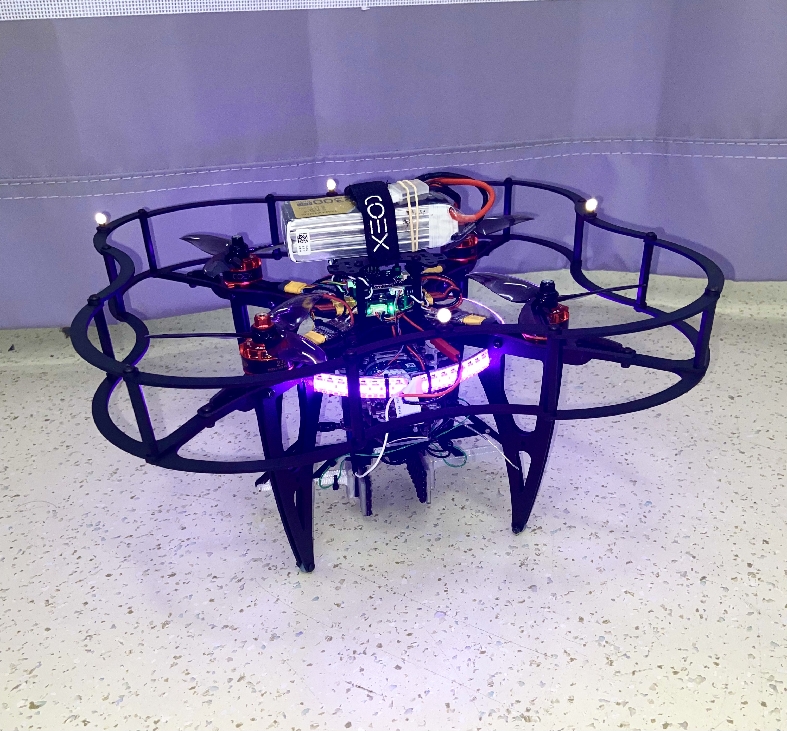

# Marker Placement

### Reflective Markers

General information on the reflective markers used can be found in the following link:



### Marker Placement with COEX Clover

The first step is attaching the OptiTrack reflective markers to the Clover drone. A good spot is putting them on the top of the drone guard as shown in the following figure:

<figure><figcaption>
COEX Clover with OptiTrack markers
</figcaption></figure>


While that is the current placement, if the guard is flimsy or vibrating during flight then this may harm data readings to some extent. This is because the program assumes the body is rigid with spacing between the markers remaining constant. A future project may be reconfiguring the Clover to introduce more rigid placements for the markers.


A list of keys points are made when attaching the markers:

1. Make sure the markers are clean and the reflective material is not worn.
2. The markers should be placed such that the shape it creates is asymmetric and they should also be placed as far apart as possible (to improve attitude readings).
3. The recommended number of markers for a rigid body is 4\~12, suggested [here](https://v30.wiki.optitrack.com/index.php?title=Rigid\_Body\_Tracking). 5 seems to be a good number, 4 also works.


The importance of an asymmetrical marker setup is so the program does not get confused when tracking the rigid body orientation. It also allows one to easily determine the heading within the motive software. Also, if one were to use two Clovers in the same motion capture setup, it would be advised to use two different asymmetrical marker shapes to avoid concurrency when tracking multiple marker sets. A more extensive guide to the marker setup can be found [here](https://v30.wiki.optitrack.com/index.php?title=Markers).


