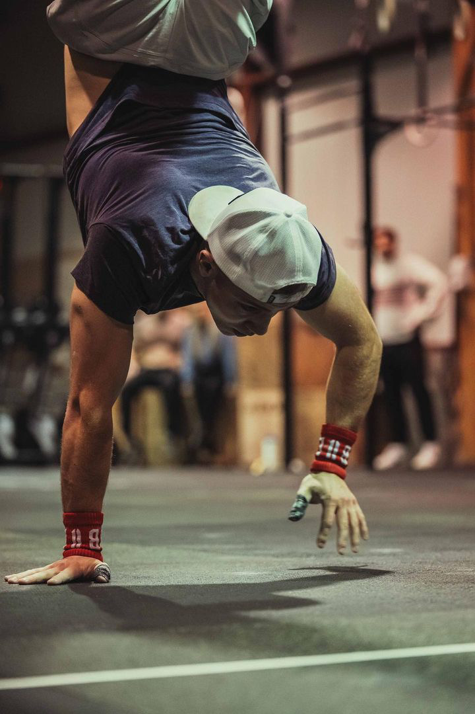
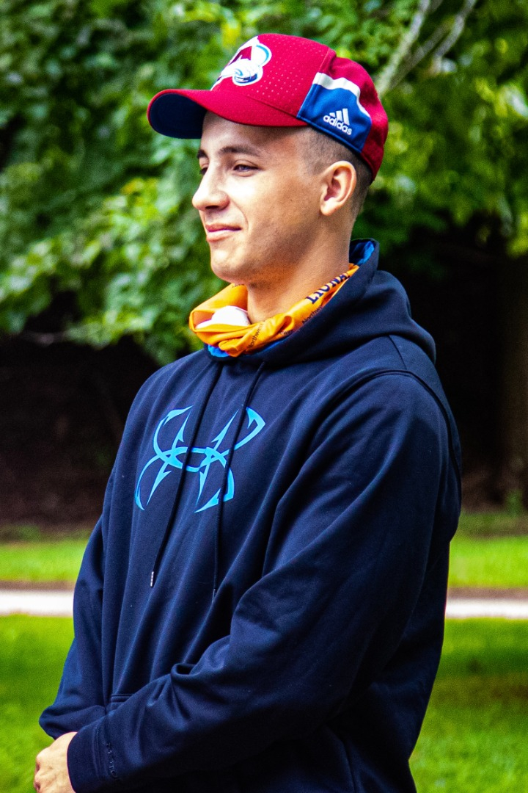

# Meet the team!

The developer of this material is a Graduate student conducting research in the Advanced Control and Mechatronics Laboratory team at Dalhousie University. My name is Sean Smith and my research focus is in the area of advanced nonlinear control of a UAV load transportation system under time varying disturbances. In order to test my developed theory, I required use of the COEX Clover platform to test integration of my control theory development into the PX4 control structure. Testing my proposed methods required grasping target objects with a gripper attached to the bottom of the Clover. A variety of reasons such as the camera field of view being blocked by the gripper, and an increased need for precise pose feedback had me transition the localization method from the Clovers ArUco system to a motion capture system that we have here in the lab. Making this transition was not a simple task where extensive debugging and implementation learning was required.&#x20;

Because of this, I felt it would be a good idea to put together my findings in case other Clover users were interested in testing new localization methods. For this project I formulated detailed explanations on the development required for this setup along with a few interesting examples that can be tested on hardware or in the Software in the Loop (SITL) simulations.

<figure><figcaption></figcaption></figure>

 

<figure><figcaption></figcaption></figure>

 

<figure><figcaption></figcaption></figure>

